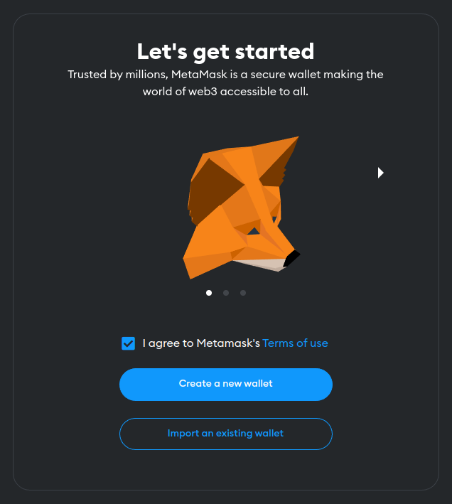
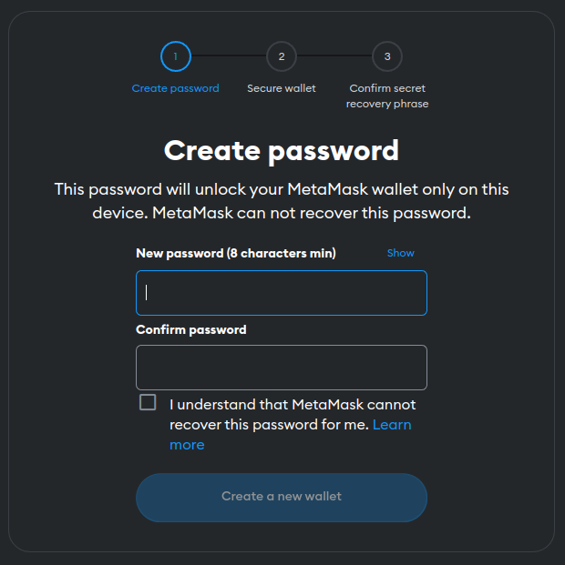
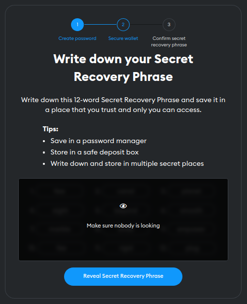
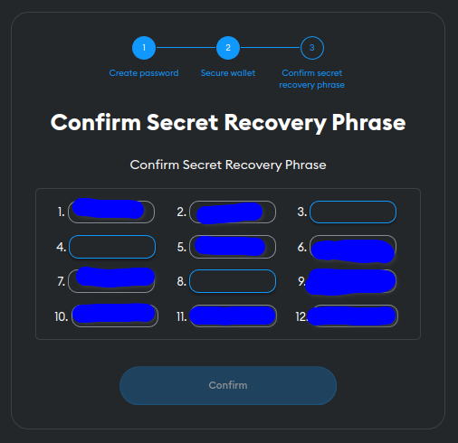
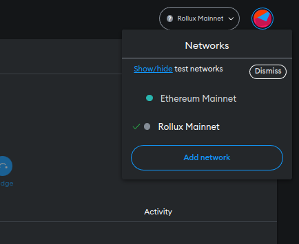

Managing assets on Rollux (or any other Ethereum-style network) means you will need a wallet to interact with the blockchain. Our community mainly recommends [Pali Wallet](https://paliwallet.com) which is already set up to use Rollux and provides mobile and browser versions. However, if you wish to use MetaMask, here are the steps to get started using it with Rollux inside a web browser (i.e. when running on a desktop: Windows, MacOS, or Linux).

## Download & Install MetaMask

1.  Head to the [MetaMask](https://metamask.io) website
1.  Click the {Download} button in the top navbar
1.  Click the button {Install MetaMask for...} which will take you to the Chrome Store or Firefox extension store
1.  Click the button {Add to...} which will initiate the installation. The button name might vary depending on your browser
1.  Once installed, the MetaMask tab will open

6.  Make sure to read the MetaMask Terms of Service. If you agree, check "I agree...", then click button {Create a new wallet}
7.  On the next screen, MetaMask asks if you consent to data collection for improving the wallet. Click either button {I agree} or {No thanks}.

8.  Now you must set your wallet password.  You will use this password to unlock your wallet in order to access funds.  Do not forget this password as no one including MetaMask can recover it for you. Enter your password twice, then check "I understand..." if you understand. Then click button {Create a new wallet}

9.  The next screen is where you will learn about the "secret recovery phrase". Watch the video and read the text carefully. Once you have a good understanding, click button {Secure my wallet (recommended)}

10.  **Make sure nobody is looking**, then click {Reveal Secret Recovery Phrase}. Now you will see your 12 word recovery phrase. Make sure to record this like a password in a safe way where no one has unauthorized access to it. This phrase enables you to recover your wallet in a worst-case scenario. If someone else gets it, they will be able to access all of your funds.  Once you have recorded it, click the button.

11.  The next screen will have you confirm that you have recorded your recovery phrase by requiring you to enter a few of the words in their proper place. Enter these, then click the button {Confirm}

12.  Now you should see "Wallet creation successful".  Read the text, then click button {Got it!}.
13.  Click {Next}
14.  Click {Done}
15.  Now you will see "What's new".  Here you can review newer features of MetaMask and decide whether to activate them.  For now, just click the "X" in the top-right corner.

## Add the Rollux network to MetaMask

16.  Now navigate your web broswer to [Rollux on ChainList.org](https://chainlist.org/?search=Rollux&testnets=true)

17.  Find the "Rollux Mainnet" tile, then click the button {Connect Wallet}.

18.  Click button {Next}

19.  Click button {Connect}

20.  Click button {Approve} 

21.  Click button {Switch network}.

**Contratulations!**  
**You have installed MetaMask and connected it to the Rollux network!**

## Final notes:

### Adding more networks

Add the **Rollux Testnet** by returning to step 17 and doing the same but for "Rollux Testnet".  
Add the **Syscoin NEVM networks** by returning to step 17 and searching for "Syscoin".

As you can see, ChainList.org is a great tool!  It makes it easy to add practically any Ethereum-style network to your wallet!

### Switching MetaMask to use a different network

You can switch your MetaMask to a different network very easily!  Just click the network drop-down list at the top-righthand corner of your MetaMask window, and select which network you need to use at the moment.

### About your accounts/addresses in MetaMask

One great thing about EVM (Ethereum Virtual Machine) is your accounts/addresses remain the same across all the different EVM networks! That means you can use the same addresses on Ethereum and Syscoin NEVM as you do on Rollux! Just remember, you must be connected to that network with your MetaMask in order to access any funds/assets you have on that network!

### Importing your accounts to a different Ethereum-style wallet

Tired of MetaMask or need to use a different Ethereum-style wallet for any reason? You can import your account into any other Ethereum-style wallet, like [Pali Wallet](https://paliwallet.com), by using your 12 word recovery phrase!

## Have questions? [**Get Support**](get-support.md).

