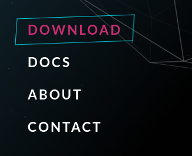
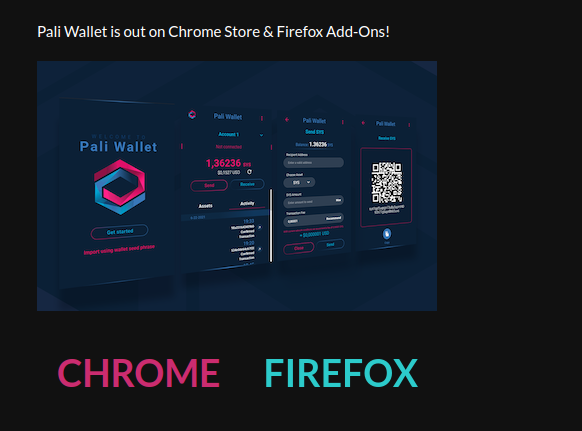
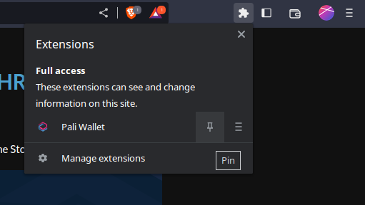
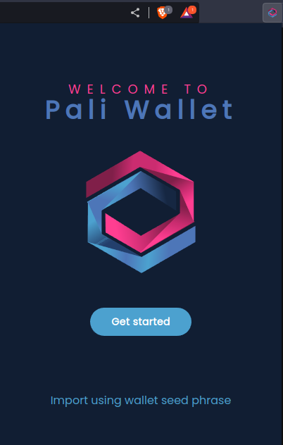
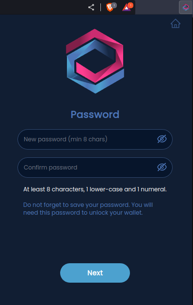
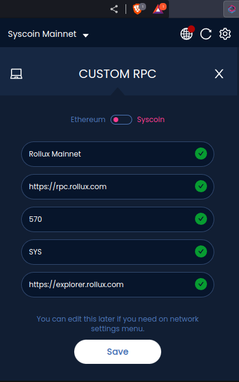

Managing assets on Rollux (or any other Ethereum-style network) means you will need a wallet to interact with the blockchain. Our community mainly recommends Pali Wallet. Pali is already set up to use Rollux and provides mobile and browser versions. Here are the steps to get started using Pali with Rollux inside a web browser (i.e. when running on a desktop: Windows, MacOS, or Linux).

## Download & Install Pali Wallet

1.  Head to the [Pali Wallet](https://paliwallet.com) official website

2.  Click the {Download} button at the bottom-left

3.  Click the button {Chrome} or {Firefox} depending on which browser you use. If you use Brave, Chromium, or any other Chrome-based browser, click {Chrome}. The button will take you to the appropriate store for you to download Pali Wallet.
4.  In the store, click the {Add to ...} button. This button name might vary depending on your browser. If you get a notification, click {Add extension}. This will download and begin installing Pali.
5.  Now wait for a browser notification that Pali has been installed.

6.  Click the Extensions icon toward the top-right of your browser (this might be different in Firefox-based browsers). Click the Pin icon next to Pali Wallet. This will add the Pali extension to your navigation bar, making it easier to access.
7.  Now click the Pali Wallet icon in your navigation bar. This will begin the setup process.

8.  Click {Get started}

9.  Now you must set your wallet password.  You will use this password to unlock your wallet in order to access funds.  Do not forget this password as no one including the Pali Wallet team can recover it for you. Make sure nobody is looking, then enter your password twice and click {Next}.

10.  Now you will see your 12 word recovery phrase. Make sure to record this like a password in a safe way where no one has unauthorized access to it. This phrase enables you to recover your wallet in a worst-case scenario. If someone else gets it, they will be able to access all of your funds.  Once you have recorded it, click the button.

11.  On the next screen you will validate that you have indeed recorded your recovery phrase.  Click the words in the proper order to rebuild your recovery phrase. Then click {Validate}

12.  Click {Ok}

**Congratulations!** 🎉 
**You've installed Pali Wallet.  Next, we'll add the Rollux network!**

## Add the Rollux network to Pali Wallet

13.  Now open Pali Wallet.

14.  Click the network dropdown at the top left.  Now move down and click the button {Custom RPC}.

15.  Enter the Rollux network details exactly as seen above.  Then click the button {Save}, then the button {Close}.

16.  Now switch to the Rollux network in Pali by going to the network dropdown > Web3 Networks, then scroll down and select {Rollux Mainnet}.

**Congratulations!** 🎉 
**You are now using Rollux with Pali Wallet.**

## Final notes:

### Adding more networks

Add the **Rollux Testnet** by returning to step 14 and doing the same but with [Rollux Testnet details](start-using-rollux-testnet/#rollux-tanenbaum-testnet-network-details).

As you can see, you can add any EVM network here if you have the details. Details for many different networks are available on [ChainList](https://chainlist.org).

### Switching Pali to use a different network

You can switch your MetaMask to a different network very easily!  Just click the network drop-down list at the top-left corner of your Pali window, and select which network you need to use at the moment.

### About your accounts/addresses in Pali Wallet

One great thing about Pali is it supports both Ethereum-style and Bitcoin-style chains! Please note that these two main network-types use different types of addresses.

All Ethereum-style EVMs (Ethereum Virtual Machine) blockchains enable you to use the same accounts/addresses across all the different EVM networks! That means you can use the same addresses on Ethereum and Syscoin NEVM as you do on Rollux! Just remember, you must be connected to that network with your Pali in order to access any funds/assets you have on that network!

Bitcoin-style (aka "UTXO") blockchains are a little different! Not only do they use addresses that are completely different from Ethereum-style chains, but they also might use completely different address types from other Bitcoin-style chains.  **Be mindful of these differences!**

### Importing your accounts to a different Ethereum-style wallet

If you need to use a different Ethereum-style wallet for any reason, you can import your account into any other Ethereum-style wallet, like [MetaMask](https://metamask.io), by using your 12 word recovery phrase!

## Have questions? [**Get Support**](get-support.md).

