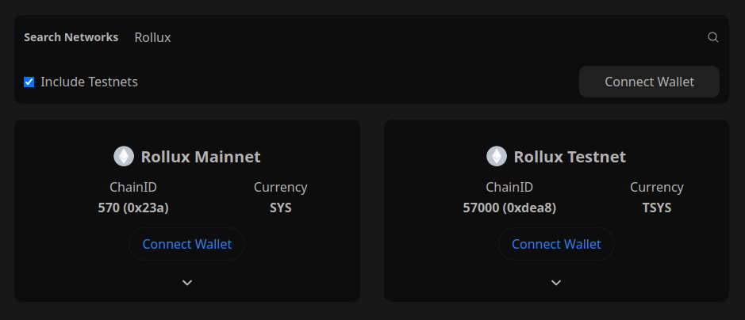
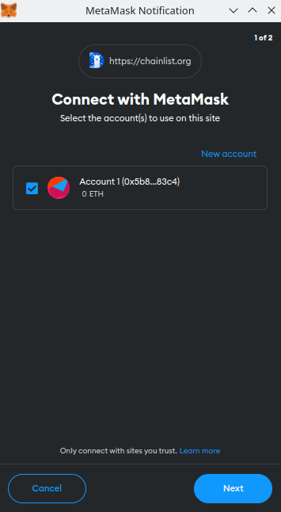
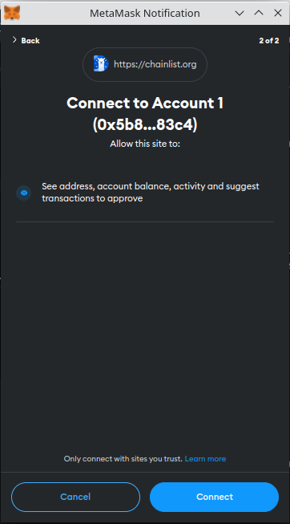
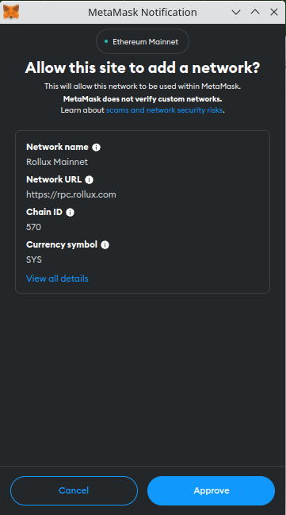
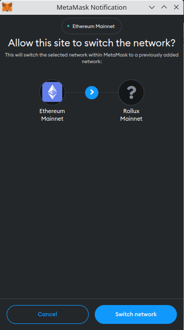
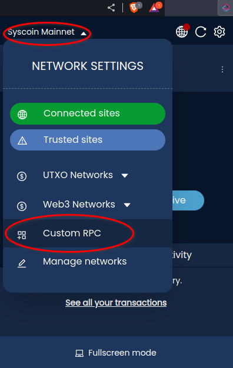

## Connect your wallet to Rollux Tanenbaum (testnet)

### Add to MetaMask

1.  Now navigate your web broswer to [Rollux on ChainList.org](https://chainlist.org/?search=Rollux&testnets=true)

2.  Find the "Rollux Testnet" tile, then click the button {Connect Wallet}.

3.  Click button {Next}

4.  Click button {Connect}

5.  Click button {Approve} 

6.  Click button {Switch network}.

**Contratulations!**🎉  
**You have connected MetaMask to Rollux Tanenbaum (testnet). Now use a Rollux Tanenbaum [**faucet**](../useful-tools/faucets.md) to get some Test SYS (TSYS).**

### Add to Pali Wallet

1.  Now open Pali Wallet.

2.  Click the network dropdown at the top left.  Now move down and click the button {Custom RPC}.

3.  Enter the Rollux network details exactly as listed [here](#rollux-tanenbaum-testnet-network-details).  Then click the button {Save}, then the button {Close}.

4.  Now switch to the Rollux network in Pali by going to the network dropdown > Web3 Networks, then scroll down and select {Rollux Mainnet}.

**Congratulations!**🎉  
**You have connected Pali Wallet to Rollux Tanenbaum (testnet). Now use a Rollux Tanenbaum [**faucet**](../useful-tools/faucets.md) to get some Test SYS (TSYS).**

## Rollux Tanenbaum (testnet) network details

Some wallets might require you to enter network details manually. If you need those details for Rollux Mainnet, they are as follows:  

| Field | Content |
| --------- | ----- |
| Network Name | **`Rollux Testnet`** |
| RPC server | **`https://rpc-tanenbaum.rollux.com`** |
| Chain ID | **`57000`** |
| Coin name | **`TSYS`** |
| Explorer | **`https://rollux.tanenbaum.io`** |

## Have questions? [**Get Support**](get-support.md).